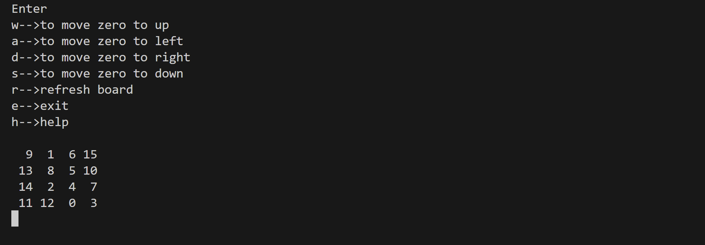

# Number-Sliding-Puzzle-Game-in-C

## Overview


This project implements a **Number Sliding Puzzle Game** in C, where the player arranges a shuffled grid of numbers into ascending order by moving a zero (empty space). Each game starts with a randomized board, ensuring a unique challenge every time.

## Features

- Cross-platform compatibility (Windows and Unix-based systems).
- Shuffle the puzzle board for a fresh start.
- Move the empty space (zero) using directional controls.
- Help menu to guide players about the game rules.
- Real-time validation to check if the puzzle is solved.

## How to Play

1. Run the program and enter your name.
2. The puzzle board is displayed as a 4x4 grid with numbers from 1 to 15 and one empty space represented by `0`.
3. Use the following keys to move the empty space (zero):
   - `W`/`w`: Move up.
   - `A`/`a`: Move left.
   - `S`/`s`: Move down.
   - `D`/`d`: Move right.
4. Additional controls:
   - `R`/`r`: Shuffle the board.
   - `H`/`h`: View the solved state (winning goal).
   - `E`/`e`: Exit the game.
5. Arrange the numbers in ascending order (left to right, top to bottom) to win the game.

## How to Compile and Run

1. Open a terminal or command prompt.
2. Compile the code using GCC or any C compiler:
   ```bash
   gcc Puzzle_game.c -o Puzzle_game
   ```
3. Run the program:
   ```bash
   ./Puzzle_game
   ```

## Future Improvements

- Add a move counter to track player (space i.e, zero) efficiency.
- Implement a leaderboard to record best scores.
- Allow dynamic grid sizes (e.g., 3x3 or 5x5).